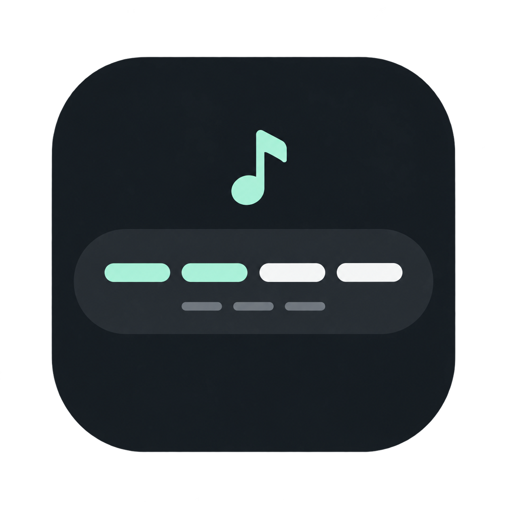

<p align="center">
  
</p>

<p align="center">
  
</p>

<p align="center">
  Live radio. Lyrics that follow along. Control at your fingertips.<br>
  Made for your MacBook Touch Bar, with Omarchy and Radio Atlas.
</p>

<p align="center">
  <a href="#get-started">Get started</a> ·
  <a href="docs/GUIDE.md">Setup guide</a> ·
  <a href="CHANGELOG.md">What’s new</a>
</p>

<br>

[](assets/screenshots/lyrics-live-01.png)

<p align="center"><sub>A real Touch Bar. A real song. <a href="assets/screenshots/README.md">View the captures</a>.</sub></p>

<br>

## Stay in the music.

Your station, song, and artist, right where your hands are. Change stations with a tap. Swipe to find the right volume. Open Radio Atlas without breaking your flow.

## Follow every line.

Add optional synchronized lyrics and watch the current line light up as the song plays, with the next line just below. Artwork, title, and artist sit alongside. Long names scroll naturally, including Japanese text.

[](assets/screenshots/lyrics-live-02.png)

<sub>Lyrics depend on recognition and availability. The highlight follows line timing; it is not word-by-word alignment.</sub>

## There’s more to every song.

Tap the artwork to open a song window with a larger cover, album details, and release information when available. Add optional Wikipedia background to explore the artist, song, and album. The same window follows what’s playing.

## Fits right in.

Keep brightness, keyboard backlight, and system volume within reach. Expand the extra controls when you need them. Add a microphone button for Voxtype dictation if it’s part of your setup.

<br>

## Get started

You’ll need a **T2 MacBook with a working tiny-dfr Touch Bar**, **Omarchy with Hyprland Lua and omarchy-shell**, and **[Radio Atlas](https://github.com/AksharP5/omarchy-radio-atlas)**. Check the [full requirements](docs/GUIDE.md#requirements) first.

```sh
omarchy plugin add https://github.com/tonybo/omarchy-touchbar-radio.git --enable
omarchy-shell shell summon tonybo.touchbar-radio '{}'
```

In the setup panel, choose **Preview setup**, then **Install hardware support**. The installer backs up replaced files and asks for confirmation before making changes.

**Want live lyrics?** Follow the [lyrics and song-details setup](docs/GUIDE.md#enable-karaoke-and-song-details). It requires a separate Python 3.12 environment and optional recognition dependencies. [How recognition uses audio and online services →](docs/GUIDE.md#network-use-and-timing)

**Chinese/Japanese lyric coverage:** LRCLIB is tried first, then NetEase. See the [NetEase login guide](docs/NETEASE.md) for phone verification, explicit browser-session import, private storage, expiry and removal. No account credentials belong in this checkout.


Prefer the terminal? Use the [standalone installer](docs/GUIDE.md#standalone-installation).

<sub>Developed and tested by hand on a T2 MacBook with a 2170 × 60 Touch Bar. The packaged installer has automated test coverage; installation on a second machine, Apple Silicon, and other Touch Bar hardware remain unvalidated.</sub>

## Make it yours

[Controls](docs/GUIDE.md#controls) · [Customization](docs/GUIDE.md#customize) · [Updates & removal](docs/GUIDE.md#updates-and-removal) · [Troubleshooting](docs/GUIDE.md#troubleshooting)

[Lyrics help](docs/LYRIC-DISPLAY.md) · [Fn key fix](docs/FN-LAYER-FIX.md) · [Wake recovery](docs/WAKE-RECOVERY.md) · [Migration](docs/MIGRATING.md)

[Contribute](CONTRIBUTING.md) · [Architecture](docs/ARCHITECTURE.md) · [Development](docs/GUIDE.md#development)

---

Made for [Omarchy](https://omarchy.org). Powered by [tiny-dfr](https://github.com/AsahiLinux/tiny-dfr) and [Radio Atlas](https://github.com/AksharP5/omarchy-radio-atlas), with optional [Voxtype](https://voxtype.io).

[MIT licensed](LICENSE). An independent community project.
