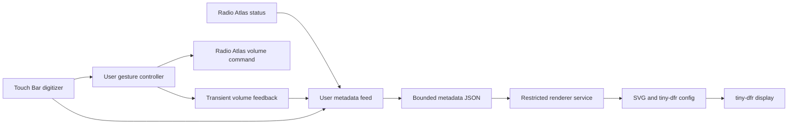

# Architecture

## Process boundaries

`src/gestures.py` runs as the desktop user. It reads only the Touch Bar digitizer and tiny-dfr virtual keyboard, without grabbing either. It invokes Radio Atlas commands with argument arrays, never shell-evaluated metadata. On a swipe it coalesces volume updates so only one player command runs at a time; the most recent target wins.

`src/feed.py` runs as the desktop user. It forwards a small allowlist of station, title, volume, and playback fields, plus touch state and transient visual feedback. It supplies a monotonic heartbeat so the renderer can clear stale data after the user session ends. A file lock prevents the renderer from reading a half-written metadata snapshot.

`src/renderer.py` runs in a systemd service. Its code, base template, and output files are root-owned. `ProtectHome=true` hides home directories and `/run/user`; it sees only the dedicated JSON input in `/var/lib/omarchy-touchbar-radio`. Input reads reject symlinks at every path component and reject oversized/non-regular files. Station and track strings are escaped into SVG. The service has no network access. Its only writable configuration directory is root-owned `/etc/tiny-dfr`, allowing temporary SVG files to be atomically renamed over complete icons. The base template remains outside that directory.

The input directory remains root-owned. The desktop user owns only the inert metadata file. Input permissions use read-only named-user ACLs on the two exact Touch Bar device names, rather than membership in the `input` group.

## Why raw touches?

XKB exposes Linux F14–F17 as `XF86Launch5`–`XF86Launch8` on the tested system. The original F-key bindings therefore did not fire. Playback controls use the actual keysyms; the media panel itself has `Action=[]` and is handled from raw coordinates.

More importantly, the tiny-dfr version used for the prototype clears its touch bookkeeping on config reload. Reloading a scrolling SVG during a keypress can lose its release. The radio panel now has no virtual key action to get stuck, and its independent gesture state survives animation. Refreshes pause for touches on ordinary buttons. For the active radio volume gesture, the renderer can safely update the visual meter.

The digitizer emits **changed axes only**. A contact often has an X coordinate but no Y event at all. The controller seeds current coordinates with ioctls and retains position per multitouch slot across contacts. Treating each new tracking ID as a completely empty position was the cause of the prototype's non-working taps and swipes.

## Rendering

The renderer uses escaped SVG with Pango-measured text. Long labels scroll within a clip rectangle, with pauses at both ends. During a swipe the panel becomes a large percentage and level meter, updating up to 25 times per second. A 50 ms exponential smoothing constant softens discrete input updates. Feedback expires shortly after release.

Writing only a new SVG is insufficient: tiny-dfr also needs a config notification to reload its image handle. The renderer writes the config **in place**, preserving the inode that tiny-dfr watches. Atomic replacement of that config can lose the watch in some versions. The base template stays separate from the generated file.

## Current boundaries

- Radio Atlas is the only media source. General MPRIS support is a future extension.
- Tested hardware is a T2 2170 × 60 Touch Bar. Other display widths need physical validation.
- The raw digitizer name is currently T2-specific.
- The updater redraws through tiny-dfr's config reload mechanism, not a native animation API. The [optional tiny-dfr patch](FN-LAYER-FIX.md) preserves Fn layer selection during reloads. A future upstream image-refresh API would remove the full-config reload overhead.
- Gesture hitboxes refresh when the lyric panel expands or collapses.
- Installation supports one desktop user per machine.
- Generated config is managed by this project; customizations belong in the base template.

## Suspend and device loss

The optional [wake recovery integration](WAKE-RECOVERY.md) stops and temporarily
masks tiny-dfr before sleep, then queues its restoration after wake. The patched
daemon handles failed framebuffer access without drawing through a stale
handle or panicking in cleanup. These changes are separate from the shell
plugin and hardware renderer installation.

## Karaoke and song information

The opt-in Python 3.12 worker identifies the Radio Atlas stream by PipeWire serial,
captures only that sink input, and uses ShazamIO and LRCLIB for recognition and
line timing. Results are rejected when they contradict station metadata. Native
song-link titles supplement translated titles during lyric lookup. A worker
thread handles network work; publication continues every 100 ms.

The feed validates the result's identity and heartbeat before forwarding it to
the offline renderer. High-resolution artwork stays in the user runtime directory;
only its cache filename enters metadata. The renderer receives a bounded 48-pixel
thumbnail for the Touch Bar. Full artwork is embedded only in the local HTML card.

The gesture worker launches that card through the fixed transient user unit
`touchbar-song-window.service`, with a dedicated Chromium profile. Starting a
new systemd service avoids inheriting the gesture service's PrivateTmp namespace,
which otherwise conflicts with Chromium's main-profile singleton socket. Taps
focus the existing card, and a fixed unit name prevents concurrent starts.

All SVG icons are published by atomic rename before the existing config inode
is updated. This prevents tiny-dfr from opening an empty or partial SVG during
animation. Long cover-box text uses the same measured scrolling logic as the
standard panel, with separate clips and a reset on song identity changes.
